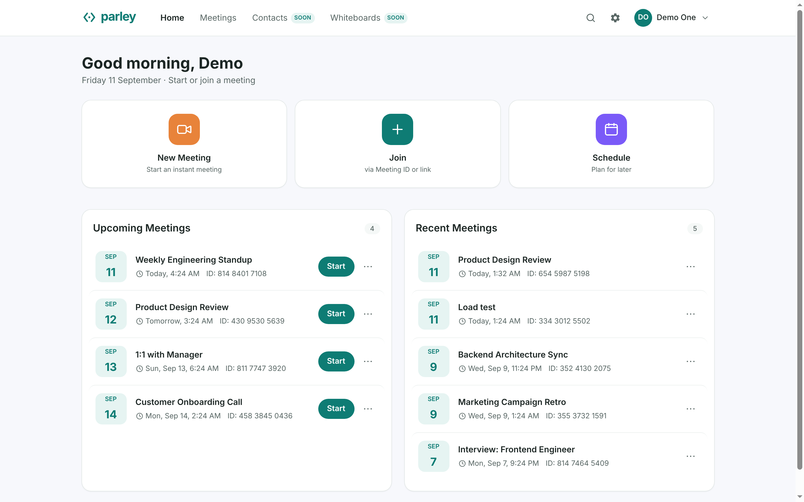

# Parley

A video meeting application: instant or scheduled meetings, joined by meeting ID
or invite link, with camera, mic, chat, reactions, screen share, a waiting room
and host controls. Media is peer-to-peer WebRTC. The server relays signalling and
application events and never touches media.



Other screens: [in a meeting](docs/screenshots/meeting.png),
[prejoin](docs/screenshots/prejoin.png), [scheduling](docs/screenshots/schedule.png),
[signup](docs/screenshots/signup.png), [verification](docs/screenshots/signup-otp.png).
`backend/tools/screenshots.py` regenerates them at 1440x900 in headless Chrome.

## Stack

| Layer     | Technology |
| --------- | ---------- |
| Frontend  | Next.js 15 (App Router, client-rendered), React 18, TypeScript, Tailwind CSS |
| Backend   | Python 3.12, FastAPI, SQLAlchemy 2.0, Pydantic v2, Uvicorn |
| Database  | PostgreSQL (Neon pooled endpoint), Alembic migrations |
| Real-time | WebRTC mesh (`RTCPeerConnection`) plus a FastAPI WebSocket signalling hub |
| Auth      | JWT (PyJWT), bcrypt password hashing, email OTP over SMTP |

Outside the core stack the backend uses only PyJWT, bcrypt and python-dotenv, and
the frontend nothing beyond React and Next. The API client uses `fetch`.

## What it does

- Instant meetings generate an 11-digit meeting ID and an invite link. Scheduled
  ones take a topic, start time and duration, and show non-hosts a countdown.
- Join by meeting ID or invite link, behind a prejoin screen with device preview.
- Email and password login, OTP-verified signup, stateless JWT bearer sessions.
  Invite links work without an account, and guest names get a `(Guest)` suffix.
- The room carries presence, mic and camera toggles, chat, reactions, raise-hand,
  speaker and gallery views with pin, active-speaker highlight, rename and a timer.
- Screen share sends camera and screen together, screen large with a filmstrip.
- Host controls are waiting room, lock, mute on entry, join before host, and gates
  for share, unmute, video, rename, chat and reactions. Live actions are mute all,
  mute or remove, spotlight, lower hand, ask to unmute, and end for all.
- Passcodes ride in invite links, are required for ID-only joins, bypassed by the
  host, and never exposed to non-hosts.

## Architecture

Three planes with different scaling properties.

```
Browser A <-------- 3. WebRTC audio and video, direct -------> Browser B
    |                                                              |
    +---- 1. HTTPS (JWT bearer, stateless) ---> FastAPI REST <------+
    |                                                              |
    +---- 2. WSS (signalling) ---> WS hub ---> DB <-----------------+
```

| Plane | State | Scaling |
| --- | --- | --- |
| HTTP API | Stateless (JWT, no server sessions) | Horizontal; database connection count is the ceiling |
| Signalling (WS) | Room membership held in process | Single instance; cross-instance is not supported |
| Media (WebRTC mesh) | None; the server sees no media | Bounded by client uplink and CPU |

Each peer encodes and uploads N-1 copies of its own video, so client cost grows
with the square of room size while the server stays idle. See [Limits](#limits).

Joining goes: `POST /api/meetings/{number}/join` with guests permitted, where the
server derives `is_host` and `admission` from the database rather than from client
input and returns a per-participant `ws_token`. Then
`WS /ws/meetings/{number}?pid=...&token=...`, where the hub re-reads both rows and
closes with code `4003` if the token does not match. That check is the only grant
of host privileges on the socket. Admitted peers get a `peers` snapshot, waiting
peers are held in a lobby, and the hub relays `offer`, `answer` and `ice` verbatim
without parsing or terminating media. Chat, reactions, raise-hand, screen-share
state and host controls share the same socket.

The hub is `backend/app/ws.py`, active-speaker ranking is
`backend/app/speakers.py`, and the data model is `backend/app/models.py`: four
tables, `users`, `meetings`, `participants` and `pending_signups`, with Alembic
owning the schema.

## Running it locally

Requires Node.js 18+ and Python 3.12. `render.yaml` pins 3.12.6; 3.10+ runs.

```bash
cd backend
python -m venv .venv && source .venv/bin/activate    # Windows: .venv\Scripts\activate
pip install -r requirements.txt
cp .env.example .env                                 # development OTP needs no edits
alembic upgrade head                                 # point DATABASE_URL at Postgres first
uvicorn app.main:app --reload --port 8000

cd frontend
npm install
cp .env.example .env.local                           # already points at localhost:8000
npm run dev
```

Open `http://localhost:3000`. The API serves on `http://localhost:8000` with
interactive docs at `/docs`, which is the reference for every endpoint. All
`/api/*` routes need a bearer token except `GET /api/meetings/{number}` and
`POST /api/meetings/{number}/join`, which permit guests so invite links work.
In-meeting participant controls run over the WebSocket, not REST.

Every setting is documented in `backend/.env.example`. The ones that change
behaviour most are `DATABASE_URL`, `JWT_SECRET`, `SMTP_USER` with `SMTP_PASS`,
`ROOM_CAP` and `VIDEO_BUDGET`.

Alembic owns the schema. The app verifies its tables exist at startup and refuses
to boot otherwise, so a failed migration cannot leave a half-built database. Use
`alembic upgrade head` to apply, `alembic current` to inspect, and `alembic check`
to confirm models and migrations agree. Leaving `DATABASE_URL` unset falls back to
local SQLite so the tests run offline; production refuses to start without it.

For a multi-peer meeting, start one in a window and open the invite link in a
second incognito window as a guest. Demo logins are opt in: set
`SEED_DEMO_ACCOUNTS=true` and a `DEMO_PASSWORD`, which has no default.

```bash
cd backend && pip install -r requirements-dev.txt
pytest                                       # 197 tests, SQLite, offline
TEST_DATABASE_URL=postgresql://... pytest    # same suite against Postgres

cd e2e && npm ci && npx playwright install firefox
npx playwright test                          # 12 tests, no running server needed
```

The API suite builds its schema from migrations, not `create_all()`, so a green
run also proves `alembic upgrade head` works from empty. Running it on SQLite and
then Postgres doubles as a cutover check. It drops every table before and after,
and refuses a remote database unless `PARLEY_TEST_ALLOW_REMOTE=1` is set.
Playwright starts its own SQLite backend and a production frontend build on
loopback ports, with synthetic media and no email sent. CI runs both suites plus
the frontend type-check and lint on every pull request:
[`.github/workflows/ci.yml`](.github/workflows/ci.yml). Coverage notes:
[`docs/TESTING.md`](docs/TESTING.md).

## Limits

### Room size

Uplink and CPU grow with the square of the room, and participants pay that cost.
Raising the ceiling properly requires an SFU. Two mitigations ship.

Active-speaker paging: each client subscribes to the top 5 by rank plus anyone
pinned, spotlighted or screensharing, and asks the rest to stop sending video.
Senders comply with `replaceTrack(null)`, which needs no renegotiation. Ranking is
server-side with hysteresis so all clients derive the same set. A sender only
saves uplink once every receiver has dropped it, so one pin keeps one encode alive.

Encoder caps: `maxBitrate`, `scaleResolutionDownBy` and `maxFramerate` step down as
receiver count grows, from 1.2 Mbps at full resolution and 30 fps with one receiver
to 200 kbps at a third resolution and half framerate past six. H.264 is preferred
so hardware encoders can be used.

`ROOM_CAP` is 10, enforced on the join endpoint and the WebSocket. Ramped 2 to 12
headless Chrome peers on a 20-core i7-12700H, via `backend/tools/loadtest.py`:

| peers | uplink/peer | downlink/peer | sent video | outbound streams | CPU per peer | quality limited by |
|---|---|---|---|---|---|---|
| 2 | 343 kbps | 343 kbps | 480p @ 19.5 fps | 2 | 25% of a core | none |
| 4 | 738 kbps | 738 kbps | 320p @ 19.9 fps | 12 | 42% | none |
| 6 | 845 kbps | 845 kbps | 240p @ 19.7 fps | 30 | 53% | none |
| 8 | 500 kbps | 500 kbps | 178p @ 13.2 fps | 49 | 60% | none |
| 10 | 490 kbps | 456 kbps | 173p @ 13.4 fps | 81 | 83% | none |
| 12 | 486 kbps | 486 kbps | 166p @ 14.0 fps | 99 | 98% | bandwidth, 2 of 132 |

Unpaged, uplink grows linearly: 845 kbps at 6 peers extrapolates to roughly
1.9 Mbps at 12. It flattens at eight instead (500, 490, 486 kbps), because past the
video budget each new participant adds a subscriber, not another encode. Stream
counts agree: 49 where an unpaged mesh would carry 56, 99 where it would carry 132.
The 480p to 320p to 240p to 170p staircase is the encoder tiers tracking receiver
count; `qualityLimitationReason` stays `none` through 12 peers, where 2 of 132
streams report `bandwidth`. The cap is 10 because ten is the last rung with
headroom on both binding constraints, 83% of one core against 98% and no stream at
a bandwidth limit. Video at the cap is roughly 180p.

All clients select the same top-K from the same ranking, so load concentrates and a
sender's cost depends on how often they are ranked. Every peer in this harness runs
on one machine: bitrate transfers directly, CPU does not, since a real participant
pays for one encode set and N-1 decodes while the test machine pays for all N of
both. Treat CPU as an upper bound.

### Other limits

- TURN needs an account. The relay path is wired (`GET /api/ice`, credential
  rotation without a rebuild, ICE restart on failure) but the default relay does
  not work. Open Relay's public endpoint answers a 401 challenge then refuses every
  allocation with `400`, identically for its own documented credentials, a wrong
  password and a nonexistent user, and its `:443` TLS certificate does not match
  its hostname. Until `TURN_URLS`, `TURN_USERNAME` and `TURN_CREDENTIAL` point at a
  real account, peers behind symmetric NAT or a restrictive firewall cannot
  connect. The backend warns at boot while this holds.
- Signalling room membership lives in process, so two instances would not see each
  other's rooms. A redeploy ends every meeting on the instance. Clients reconnect;
  state does not move.
- Reconnect rebuilds media: peer connections are torn down and rebuilt, costing a
  second or two of video.
- A half-open socket is detected by an unanswered 20s ping, so recovery starts that
  late at worst. A tab regaining focus or the network returning cuts the wait short.
- OTP delivery is fire-and-forget. An SMTP outage does not fail signup, but a
  delivery failure is only logged, and the recourse is the resend button.
- The hosted backend spins down after about 15 minutes idle, and a cold start
  measured 15.4 seconds. A keepalive pings `/healthz` every ten minutes between
  09:00 and 21:00 IST. Render allows 750 instance-hours a month against a roughly
  730-hour month, so continuous pinging would consume the allowance.
- The auth rate limiter is an in-memory fixed window, so it resets on restart and
  is not shared across instances.
- Broadcasts fan out concurrently, so one slow receiver does not delay others, but
  its send is still awaited and there is no bounded queue or eviction.

### Signalling-plane measurements

From `backend/tools/bench_signalling.py`. Broadcast fan-out with 12 receivers and
sends delayed 25 ms, measuring what receivers that are not slow must wait; then
event-loop blocking as ping/pong latency on an idle socket while another socket
sends persisted messages against a remote Postgres.

| slow receivers | before | after | event loop | before | after |
|---|---|---|---|---|---|
| 1 | 25.2 ms | 0.08 ms | one persisted rename | 453 ms | 0.44 ms |
| 3 | 75.5 ms | 0.09 ms | 60-write burst (max) | 27.6 s | 0.71 ms |
| 6 | 151.0 ms | 0.09 ms | | | |

With every receiver healthy, end-to-end p50 over real sockets moves from 0.61 ms
to 0.50 ms.

### Reproducing the measurements

The ramp launches up to N headless Chrome instances with synthetic cameras and will
saturate the machine it runs on.

```bash
cd backend    # with the backend and frontend running locally
python tools/loadtest.py --web http://127.0.0.1:3000 --api http://127.0.0.1:8000 \
                        --ramp 2,4,6,8,10,12 --hold 20 --json ramp.json
```

It creates a meeting through the real API, drives each browser through the real
prejoin screen, and reports uplink, downlink, sent resolution and framerate,
outbound stream count and CPU per rung. Saturation shows up as resolution and
framerate falling while `qualityLimitationReason` turns to `cpu` or `bandwidth`.
This is how `ROOM_CAP` was set; expect a lower number on weaker hardware.

`tools/verify_paging.py` wraps `RTCPeerConnection`, `setLocalDescription`,
`setRemoteDescription`, `RTCRtpSender.replaceTrack` and `WebSocket` before any
application script runs, then checks that clients agree on the ranking, tracks are
dropped, swaps happen with zero SDP exchange, and no transceiver direction flips.

## Deployment

Frontend on Vercel: import the repo, set Root Directory to `frontend`, add
`NEXT_PUBLIC_API_BASE` pointing at the backend URL, deploy.

Backend on Render or Railway: new web service, Root Directory `backend`, build
`pip install -r requirements.txt`, start
`alembic upgrade head && uvicorn app.main:app --host 0.0.0.0 --port $PORT`, which
`Procfile` and `render.yaml` both carry. The migration step is required. Set
`FRONTEND_URL`, `CORS_ORIGINS`, a strong `JWT_SECRET`, and `SMTP_USER` and
`SMTP_PASS` for real email. The frontend derives the signalling URL from
`NEXT_PUBLIC_API_BASE`, mapping `https` to `wss`.

`render.yaml` sets `healthCheckPath: /`. Both `/` and `/healthz` are liveness-only
and neither touches the database. Do not point the check at `/readyz`: it probes
the database, so a blip would take the API down, and Neon sleeps after about 5
minutes idle, so a database-touching check would hold it awake. The keepalive
targets `/healthz` for the same reason.
