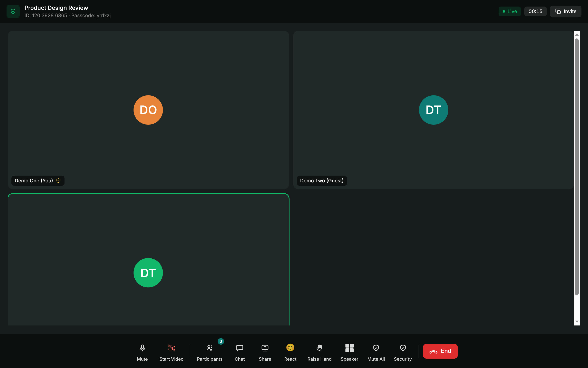
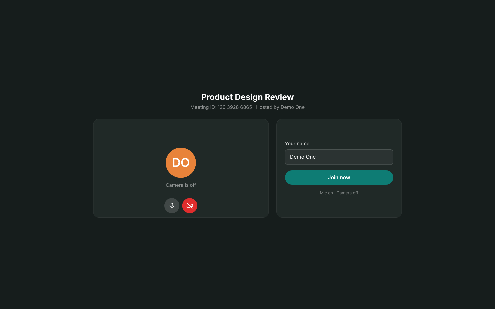
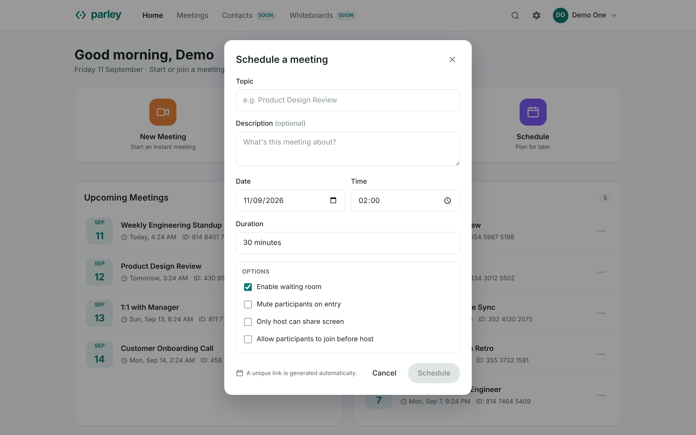
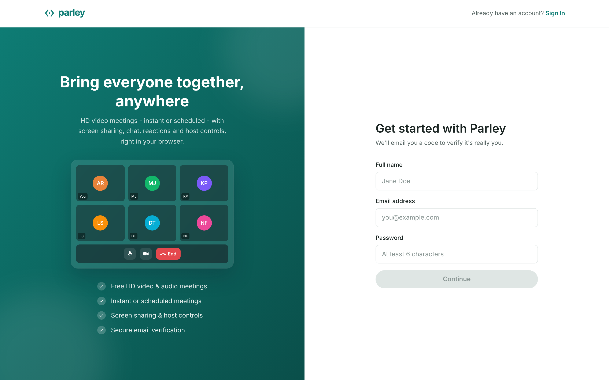
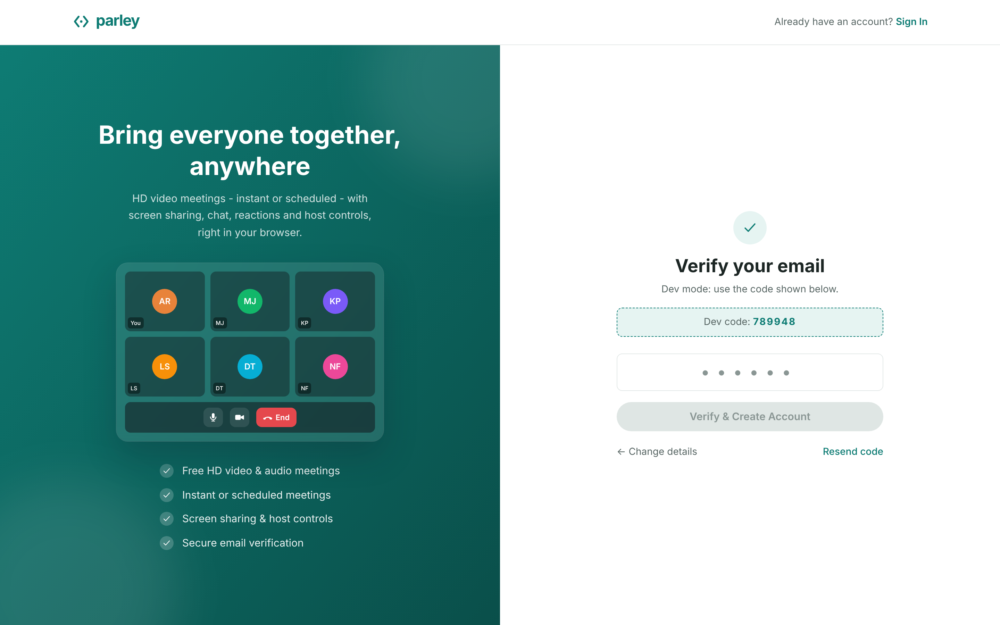

# Parley

A video meeting application. Start an instant meeting, schedule one, join by
meeting ID or invite link, and run a room with camera, mic, chat, reactions,
screen share, a waiting room and host controls.

Media is peer-to-peer WebRTC. The server relays signalling and application
events only, and never touches media.


<details>
<summary>More screenshots</summary>

**In a meeting.** Cameras are off, so tiles show avatars. The control bar
carries mute, video, participants, chat, share, reactions, raised hands,
speaker view and host-only controls.



**Prejoin.** Device check and display name before entering.



**Scheduling**



**Signup and email verification.** The code renders on screen only in
development builds with SMTP disabled. With credentials configured it is
emailed and never rendered.




</details>

Screenshots are generated by `backend/tools/screenshots.py`, which drives
headless Chrome at 1440x900 against a local instance. Re-run it after a UI
change.

## Stack

| Layer     | Technology |
| --------- | ---------- |
| Frontend  | Next.js 14 (App Router, client-rendered), React 18, TypeScript, Tailwind CSS |
| Backend   | Python 3.12, FastAPI, SQLAlchemy 2.0, Pydantic v2, Uvicorn |
| Database  | PostgreSQL (Neon pooled endpoint), Alembic migrations |
| Real-time | WebRTC mesh (`RTCPeerConnection`) plus a FastAPI WebSocket signalling hub |
| Auth      | JWT (PyJWT), bcrypt password hashing, email OTP over SMTP |

Dependencies outside the core stack are limited to PyJWT, bcrypt and
python-dotenv on the backend. The frontend adds nothing beyond React and Next;
the API client uses `fetch`.

## Features

- **Dashboard.** Navigation, search, settings, profile menu, quick actions, and
  Upcoming and Recent meeting lists.
- **Instant meeting.** Generates an 11-digit meeting ID and invite link and
  joins the creator as host.
- **Join.** By meeting ID or invite link. A prejoin screen with device preview
  validates the meeting first and reports a not-found state otherwise.
- **Scheduling.** Topic, description, start time and duration. Before the start
  time non-hosts see a countdown; the host can start early and admit from the
  waiting room.
- **Authentication.** Email and password login, OTP-verified signup over SMTP
  with a development fallback, and stateless JWT bearer sessions.
- **Guest join.** Invite links work without an account. Guest display names
  carry a `(Guest)` suffix.
- **Meeting room.** Multi-peer WebRTC with presence, mic and camera toggles,
  chat, reactions, raise-hand, speaker and gallery views with pin,
  active-speaker highlight, in-meeting rename and a timer.
- **Screen share.** The sharer broadcasts camera and screen together; receivers
  see the screen at full size with a camera filmstrip.
- **Host controls.** Waiting room, lock, mute on entry, join before host, and
  per-permission gates for share, unmute, video, rename, chat and reactions.
  Live actions: mute all, mute or remove, spotlight, lower hand, ask to unmute,
  end for all.
- **Passcodes.** Embedded in invite links, required for ID-only joins, bypassed
  by the host, never exposed to non-hosts.
- **Profile and settings.** Display name, avatar colour and photo, Personal
  Meeting ID, password change, and preferences that set prejoin defaults.
- Responsive across mobile, tablet and desktop.

## Architecture

Three planes with different scaling properties.

```
   +------------+                                +------------+
   | Browser A  |                                | Browser B  |
   +-----+------+                                +------+-----+
         |  1. HTTPS (JWT bearer, stateless)            |
         +---------------------+  +--------------------+
         |                     v  v                     |
         |               +-----------+                  |
         |  2. WSS       |  FastAPI  |                  |
         +---------------+  REST API +------------------+
         |  (signalling) |  WS hub   |                  |
         |               +-----+-----+                  |
         |                     v                        |
         |               +-----------+                  |
         |               |    DB     |                  |
         |               +-----------+                  |
         |                                              |
         +--------- 3. WebRTC audio/video --------------+
                    direct peer-to-peer, never via the server
```

### Join flow

1. `POST /api/meetings/{number}/join` (guests permitted, so invite links work).
   The server derives `is_host` and `admission` from the database, not from client
   input. It writes a `participants` row, and returns a participant id
   and a per-participant `ws_token`.
2. `WS /ws/meetings/{number}?pid=...&token=...`. The hub re-reads the meeting
   and participant from the database and closes with code `4003` if the token
   does not match. This is the only grant of host privileges on the socket.
3. Admitted peers receive a `peers` snapshot and the room receives
   `peer-joined`. Waiting peers are held in a lobby and hosts receive
   `waiting-list`.
4. Peers exchange `offer`, `answer` and `ice` messages addressed with a `to`
   field. The hub relays them verbatim and does not parse or terminate media.
5. One `RTCPeerConnection` per pair carries audio and video directly. Chat,
   reactions, raise-hand, screen-share state and host controls use the same
   WebSocket.

### Scaling properties

| Plane | State | Scaling |
| --- | --- | --- |
| HTTP API | Stateless (JWT, no server sessions) | Horizontal; database connection count is the ceiling |
| Signalling (WS) | Room membership held in process | Single instance; cross-instance is not supported |
| Media (WebRTC mesh) | None; the server sees no media | Bounded by client uplink and CPU |

In a mesh each peer encodes and uploads N-1 copies of its own video, so client
cost grows quadratically with room size while the server stays idle. See
[Limits](#limits).

## Project structure

```
parley/
├── backend/
│   ├── app/
│   │   ├── main.py         # Entrypoint, CORS, request ids, health, SIGTERM drain
│   │   ├── config.py       # Environment-driven configuration
│   │   ├── database.py     # Pooled engine with pre-ping, session, base
│   │   ├── models.py       # User, Meeting, Participant, PendingSignup
│   │   ├── schemas.py      # Pydantic request and response schemas
│   │   ├── crud.py         # Database operations
│   │   ├── security.py     # bcrypt, JWT, OTP hashing
│   │   ├── ratelimit.py    # In-memory rate limiter for auth endpoints
│   │   ├── speakers.py     # Active-speaker ranking with hysteresis
│   │   ├── ws.py           # WebSocket signalling hub
│   │   └── routers/        # auth, meetings, ice, users
│   ├── alembic/            # Migration history
│   ├── tests/              # pytest; runs on SQLite or Postgres unchanged
│   └── tools/              # Operational scripts, none imported by the app
│                           # loadtest, bench_signalling, verify_paging,
│                           # turn_probe, screenshots
├── frontend/src/
│   ├── app/                # Routes: dashboard, login, signup, meetings,
│   │                       # settings, j/[number], meeting/[number]
│   ├── components/         # Navbar, AuthShell, modals, meeting UI, tiles
│   └── lib/                # api.ts, auth.tsx, useMeeting.ts (mesh + signalling)
├── e2e/                    # Playwright suite
├── docs/
├── render.yaml
└── README.md
```

## Database schema

PostgreSQL, four tables, managed by Alembic. Users host meetings, meetings have
participants, and `pending_signups` holds transient OTP signup state.

All timestamp columns are `timestamptz` and all values are written in UTC.
Indexes cover `participants.meeting_id`, `meetings.host_id`,
`meetings.start_time`, and the unique `meetings.meeting_number` and
`users.email`.

**`users`** (created only after OTP verification)

| Column | Type | Notes |
| --- | --- | --- |
| `id` | int PK | |
| `name` | str(120) | |
| `email` | str(200) | unique |
| `password_hash` | str(200) | bcrypt |
| `is_verified` | bool | set once the email OTP is confirmed |
| `avatar_color` | str(9) | hex colour for the initials avatar |
| `avatar_url` | text, null | uploaded photo as a data URL |
| `pmi` | str(11) | Personal Meeting ID, a permanent room |
| `created_at` | datetime | |
| `pref_video_on_join`, `pref_join_muted`, `pref_mirror_video`, `pref_hd_video`, `pref_notifications` | bool | prejoin defaults |

**`meetings`**

| Column | Type | Notes |
| --- | --- | --- |
| `id` | str(36) PK | uuid4 hex |
| `meeting_number` | str(11) | unique, indexed |
| `topic` | str(200) | |
| `description` | text, null | |
| `passcode` | str(10) | required to join; host bypasses |
| `host_id` | FK users | |
| `meeting_type` | str(20) | `instant` or `scheduled` |
| `status` | str(20) | `scheduled`, `active` or `ended` |
| `waiting_room`, `locked`, `mute_on_entry`, `join_before_host` | bool | host settings |
| `allow_screen_share`, `allow_unmute`, `allow_video`, `allow_rename`, `allow_chat`, `allow_reactions` | bool | non-host permissions; host bypasses |
| `start_time` | datetime, null | scheduled meetings only |
| `duration` | int | minutes |
| `created_at` | datetime | |

**`participants`** (`ON DELETE CASCADE`)

| Column | Type | Notes |
| --- | --- | --- |
| `id` | int PK | |
| `meeting_id` | FK meetings | cascade delete |
| `user_id` | FK users, null | null means anonymous guest |
| `display_name` | str(120) | guests get a `(Guest)` suffix |
| `is_host` | bool | decided server-side, never trusted from the client |
| `is_muted`, `is_video_on` | bool | |
| `is_active` | bool | false means left or removed |
| `admission` | str(12) | `admitted`, `waiting` or `denied` |
| `ws_token` | str(40) | per-participant secret required by the WebSocket |
| `joined_at` | datetime | |

**`pending_signups`** holds an unverified signup: name, bcrypt password hash,
SHA-256 hashed OTP (`code_hash`), `expires_at` and an `attempts` counter. On
verification it becomes a `users` row and is deleted.

## Local setup

Requires Node.js 18+ and Python 3.12 (`render.yaml` pins 3.12.6; 3.10+ runs).

### Backend

```bash
cd backend
python -m venv .venv
source .venv/bin/activate          # Windows: .venv\Scripts\activate

pip install -r requirements.txt
cp .env.example .env               # development OTP works with no further edits

# Point DATABASE_URL at Postgres, then create the schema.
alembic upgrade head

uvicorn app.main:app --reload --port 8000
```

The API serves on `http://localhost:8000` with interactive docs at `/docs`.

Alembic owns the schema. The app does not create tables at startup; it verifies
they exist and refuses to boot otherwise, so a failed migration cannot produce a
half-built database.

| Command | Purpose |
| --- | --- |
| `alembic upgrade head` | Apply migrations |
| `alembic current` | Show the applied revision |
| `alembic check` | Verify models and migrations agree |
| `alembic downgrade base` | Roll back to an empty database (destroys data) |

Leaving `DATABASE_URL` unset falls back to a local SQLite file so the test suite
runs offline. Production refuses to start without a real `DATABASE_URL`.

### Tests

API suite, 173 tests over the HTTP API and the WebSocket hub:

```bash
cd backend
pip install -r requirements-dev.txt
pytest                                       # SQLite, offline
TEST_DATABASE_URL=postgresql://... pytest    # against Postgres
```

`pytest.ini` sets `testpaths` and `pythonpath`, so bare `pytest` from
`backend/` is the whole invocation.

The suite builds its schema by running migrations, not `create_all()`, so a
green run also proves `alembic upgrade head` works from an empty database. It is
engine-agnostic, so running it against SQLite and then Postgres doubles as a
cutover check.

The suite drops every table before and after the run. It refuses to touch a
remote database unless `PARLEY_TEST_ALLOW_REMOTE=1` is set.

End-to-end suite, 12 Playwright tests over signup and OTP, create and join, and
host controls:

```bash
cd e2e
npm ci
npx playwright install firefox
npx playwright test
```

No running server is required. Playwright starts a throwaway SQLite backend and
a production build of the frontend on their own loopback ports and tears both
down afterwards. Media is synthetic and no email is sent.

CI runs both suites, the frontend type-check and lint, and the browser flows on
every pull request: [`.github/workflows/ci.yml`](.github/workflows/ci.yml).
Coverage notes and untested areas: [`docs/TESTING.md`](docs/TESTING.md).

Demo accounts are seeded at startup and need no OTP. All use the password
`demo1234`:

| Name | Email |
| --- | --- |
| Demo One | `demo1@parley.app` |
| Demo Two | `demo2@parley.app` |
| Demo Three | `demo3@parley.app` |

Sign in to two of them in separate windows to exercise a multi-peer meeting.
Set `SEED_SAMPLE_DATA=true` to also seed sample meetings for the first account.

With no `SMTP_USER` or `SMTP_PASS` set, the signup code is shown in the UI and
printed to the backend console.

### Frontend

```bash
cd frontend
npm install
cp .env.example .env.local     # already points at http://localhost:8000
npm run dev
```

Open `http://localhost:3000`.

To exercise a multi-peer meeting, start one in a window and open the invite link
in a second incognito window as a guest. If camera or microphone permission is
denied, the room falls back to an avatar tile and all other controls work.

## Environment variables

**Backend** (`backend/.env`)

| Variable | Default | Purpose |
| --- | --- | --- |
| `APP_ENV` | `development` (`production` when `RENDER` is set) | Production requires a real `JWT_SECRET` and `DATABASE_URL` |
| `DATABASE_URL` | SQLite file locally; required in production | Postgres connection string; use Neon's pooled endpoint |
| `DB_POOL_SIZE` | `5` | SQLAlchemy pool size |
| `DB_MAX_OVERFLOW` | `5` | Connections above the pool size |
| `DB_POOL_RECYCLE` | `280` | Recycle before Neon's idle timeout |
| `FRONTEND_URL` | `http://localhost:3000` | Used to build invite links |
| `CORS_ORIGINS` | `http://localhost:3000,...` | Allowed CORS origins |
| `SEED_SAMPLE_DATA` | `false` | Seed sample meetings for the first user |
| `JWT_SECRET` | dev default locally; required in production | JWT signing secret |
| `JWT_EXPIRE_HOURS` | `168` | Token lifetime |
| `SMTP_HOST` | `smtp.gmail.com` | SMTP server for OTP email |
| `SMTP_PORT` | `587` | SMTP port (STARTTLS) |
| `SMTP_USER` | empty | Sending mailbox |
| `SMTP_PASS` | empty | SMTP password or Gmail app password |
| `SMTP_FROM_NAME` | `Parley` | Display name on OTP email |
| `SMTP_TIMEOUT` | `15` | SMTP socket timeout in seconds |
| `OTP_TTL_MINUTES` | `10` | OTP validity window |
| `OTP_MAX_ATTEMPTS` | `5` | Wrong codes before the pending signup is discarded |
| `ROOM_CAP` | `10` | Participant cap, enforced on the join endpoint and the socket |
| `VIDEO_BUDGET` | `5` | Remote cameras a client subscribes to at once |
| `STUN_URLS` | two Google STUN servers | Comma-separated, served by `GET /api/ice` |
| `TURN_URLS` | Open Relay (`:80`, `:443`, `turns:`) | Comma-separated TURN URLs |
| `TURN_USERNAME` | `openrelayproject` | Replace for a dedicated account |
| `TURN_CREDENTIAL` | `openrelayproject` | Replace for a dedicated account |
| `ICE_CANDIDATE_POOL_SIZE` | `2` | Candidates pre-gathered per peer connection |
| `LOG_FORMAT` | `json` in production, else `text` | `json` emits one object per line |
| `LOG_LEVEL` | `INFO` | Root log level |

Real email requires both `SMTP_USER` and `SMTP_PASS`. With either missing the
app stays in development OTP mode instead of failing at send time.

The TURN defaults point at Open Relay's public endpoint as a placeholder that
documents the expected shape and keeps the relay code path exercised. It is
verified non-functional (see [Limits](#limits)) and the backend warns at boot.
These are not secrets: the ICE list is served to the browser by design.

**Frontend** (`frontend/.env.local`)

| Variable | Default | Purpose |
| --- | --- | --- |
| `NEXT_PUBLIC_API_BASE` | `http://localhost:8000` | Backend base URL |

## Authentication

Login is email and password. Signup verifies email ownership with a 6-digit OTP
before creating the account. Passwords are bcrypt hashed and sessions are
stateless JWTs sent as `Authorization: Bearer <token>`, which works across a
cross-domain Vercel and Render split without cookies.

For real email over Gmail SMTP, set `SMTP_USER` to the sending mailbox and
`SMTP_PASS` to a Gmail app password (Google Account, Security, 2-Step
Verification, App Passwords).

Login and OTP-request endpoints are rate-limited per email.

## API reference

Base URL `http://localhost:8000`, interactive docs at `/docs`. All `/api/*`
routes require a bearer token except `GET /api/meetings/{number}` and
`POST /api/meetings/{number}/join`, which permit guests so invite links work.
In-meeting participant controls run over the authenticated WebSocket, not REST.

Every response carries an `X-Request-ID`, echoing an inbound one if present.
`POST /api/meetings/{number}/join` accepts an `Idempotency-Key` header:
replaying a key returns the participant created by the first call, which makes
a retry after a lost response safe.

| Method | Endpoint | Description |
| --- | --- | --- |
| `GET` | `/` | Liveness; the deployed health check target |
| `GET` | `/healthz` | Liveness; never touches the database |
| `GET` | `/readyz` | Readiness including a database probe; 503 if down |
| `GET` | `/api/ice` | STUN and TURN list for `new RTCPeerConnection` |
| `POST` | `/auth/signup/request-otp` | Start signup and email a 6-digit OTP |
| `POST` | `/auth/signup/resend-otp` | Resend the signup OTP |
| `POST` | `/auth/signup/verify` | Verify the OTP, create the account, return a token |
| `POST` | `/auth/login` | Email and password login |
| `GET` | `/auth/me` | Current authenticated user |
| `POST` | `/auth/change-password` | Change password |
| `GET` | `/api/meetings/upcoming` | Scheduled, not-yet-ended meetings |
| `GET` | `/api/meetings/recent` | Past meetings |
| `GET` | `/api/meetings` | All your meetings |
| `POST` | `/api/meetings/instant` | Create or reuse your instant meeting |
| `POST` | `/api/meetings/personal` | Your Personal Meeting Room |
| `POST` | `/api/meetings/schedule` | Create a scheduled meeting |
| `GET` | `/api/meetings/{number}` | Validate or fetch a meeting (guest-visible) |
| `PATCH` | `/api/meetings/{number}` | Edit a scheduled meeting (host) |
| `DELETE` | `/api/meetings/{number}` | Delete a meeting (host) |
| `PATCH` | `/api/meetings/{number}/settings` | Update host settings (host) |
| `POST` | `/api/meetings/{number}/end` | End a meeting (host) |
| `POST` | `/api/meetings/{number}/join` | Join; guests allowed, honours `Idempotency-Key` |
| `GET` | `/api/contacts` | Registered users |
| `PATCH` | `/api/profile` | Update name, avatar colour or photo |
| `GET` | `/api/preferences` | Read preferences |
| `PATCH` | `/api/preferences` | Update preferences |
| `WS` | `/ws/meetings/{number}` | Signalling, presence, chat, reactions, host controls |

## Limits

### Room size

The mesh is the binding constraint. Every peer uploads a separate encode to
every other peer, so uplink and CPU grow with the square of the room, and that
cost is paid by participants, not the server. Small groups are the design
target; raising the ceiling properly requires an SFU.

Two mitigations ship:

- **Active-speaker paging.** Each client subscribes to the top 5 by rank, plus
  anyone pinned, spotlighted or screensharing, and asks the rest to stop
  sending video. Senders comply with `replaceTrack(null)`, which requires no
  renegotiation. Ranking is computed server-side with hysteresis so all clients
  derive the same set and tracks do not thrash. A sender only saves uplink once
  every receiver has dropped it, so one pin keeps one encode alive.
- **Encoder caps.** `maxBitrate`, `scaleResolutionDownBy` and `maxFramerate`
  step down as receiver count grows, from 1.2 Mbps at full resolution and 30
  fps with one receiver to 200 kbps at a third resolution and half framerate
  past six. H.264 is preferred so hardware encoders can be used.

`ROOM_CAP` is 10, enforced on both the join endpoint and the WebSocket.

Ramped 2 to 12 headless Chrome peers on a 20-core i7-12700H
(`backend/tools/loadtest.py`):

| peers | uplink/peer | downlink/peer | sent video | outbound streams | CPU per peer | quality limited by |
|---|---|---|---|---|---|---|
| 2 | 343 kbps | 343 kbps | 480p @ 19.5 fps | 2 | 25% of a core | none |
| 4 | 738 kbps | 738 kbps | 320p @ 19.9 fps | 12 | 42% | none |
| 6 | 845 kbps | 845 kbps | 240p @ 19.7 fps | 30 | 53% | none |
| 8 | 500 kbps | 500 kbps | 178p @ 13.2 fps | 49 | 60% | none |
| 10 | 490 kbps | 456 kbps | 173p @ 13.4 fps | 81 | 83% | none |
| 12 | 486 kbps | 486 kbps | 166p @ 14.0 fps | 99 | 98% | bandwidth, 2 of 132 |

Uplink is the column to read. In an unpaged mesh it grows linearly with room
size: 845 kbps at 6 peers extrapolates to roughly 1.9 Mbps at 12. Instead it
flattens at eight (500, 490, 486 kbps), because past the video budget each new
participant adds a subscriber, not another encode. Stream counts agree: 49 where
an unpaged mesh would carry 56, and 99 where it would carry 132.

The 480p to 320p to 240p to 170p staircase is the encoder tiers responding to
receiver count. `qualityLimitationReason` stays `none` through 12 peers, where
2 of 132 streams report `bandwidth`.

The cap is 10, not 12: ten is the last rung with headroom on both binding
constraints, at 83% of one core against 98% and with no stream at a bandwidth
limit. Video at the cap is roughly 180p.

Because all clients derive subscriptions from the same server ranking, they
select the same top-K. Load concentrates instead of spreading, so a sender's
cost depends on how often they are ranked, not on room size alone.

Every peer in this harness runs on one machine. Bitrate figures transfer
directly, since a peer's uplink does not depend on peer location. CPU figures do
not: a real participant pays for one encode set and N-1 decodes, while the test
machine pays for all N of both. Treat CPU as an upper bound.

### Other limits

- **TURN requires an account.** The relay path is wired (`GET /api/ice`,
  credential rotation without a rebuild, ICE restart on failure), but the
  default relay does not work. Open Relay's public endpoint answers a 401
  challenge and then refuses every allocation with `400`, identically for its
  own documented credentials, a wrong password and a nonexistent user. Its
  `:443` TLS certificate does not match its hostname. Until `TURN_URLS`,
  `TURN_USERNAME` and `TURN_CREDENTIAL` point at a real account, peers behind
  symmetric NAT or a restrictive firewall cannot connect. The backend logs a
  warning at boot while this holds.
- **Single backend instance.** Signalling room membership lives in process, so
  two instances would not see each other's rooms. The backend does not scale
  horizontally today, and a redeploy ends every meeting on the instance.
  Clients reconnect; state does not move.
- **Reconnect rebuilds media.** A dropped socket resumes into room state with
  backoff, but peer connections are torn down and rebuilt, costing a second or
  two of video. Signalling carries renegotiation, so a peer connection
  outliving its socket is not manageable.
- **Heartbeat detection is not instant.** A half-open socket is detected by an
  unanswered 20s ping, so recovery starts roughly that late in the worst case.
  A tab regaining focus or the network returning short-circuits the wait.
- **OTP delivery is fire-and-forget.** Signup does not wait on SMTP, so an
  outage no longer fails signup, but a delivery failure cannot be reported in
  the response. It is logged, and the user's recourse is the resend button.
- **Free-tier cold starts.** The hosted backend spins down after about 15
  minutes idle, and a cold start measured 15.4 seconds. A keepalive pings
  `/healthz` every ten minutes between 09:00 and 21:00 IST. Render allows 750
  instance-hours a month against a roughly 730-hour month, so continuous
  pinging would consume the whole allowance.
- **Rate limiting is per-process.** The auth limiter is an in-memory fixed
  window, so it resets on restart and is not shared across instances.
- **Slow consumers are unbounded.** Broadcasts fan out concurrently, so one
  slow receiver does not delay others, but its send is still awaited and there
  is no bounded queue or eviction.

### Signalling-plane measurements

From `backend/tools/bench_signalling.py`.

Broadcast fan-out with 12 receivers and sends delayed 25 ms, measuring what
receivers that are not slow must wait:

| slow receivers | before | after |
|---|---|---|
| 1 | 25.2 ms | 0.08 ms |
| 3 | 75.5 ms | 0.09 ms |
| 6 | 151.0 ms | 0.09 ms |

With every receiver healthy, end-to-end p50 over real sockets moves from 0.61
ms to 0.50 ms. Concurrency buys nothing when nobody is slow.

Event-loop blocking, measured as ping/pong latency on an idle socket while
another socket sends persisted messages against a remote Postgres:

| | before | after |
|---|---|---|
| behind one persisted rename | 453 ms | 0.44 ms |
| during a 60-write burst (max) | 27.6 s | 0.71 ms |

### Reproducing the measurements

The media-plane ramp launches up to N headless Chrome instances with synthetic
cameras and will saturate the machine it runs on.

```bash
# with the backend and frontend running locally
cd backend
python tools/loadtest.py --web http://127.0.0.1:3000 \
                        --api http://127.0.0.1:8000 \
                        --ramp 2,4,6,8,10,12 --hold 20 \
                        --json ramp.json
```

It creates a meeting through the real API, drives each browser through the real
prejoin screen, and reports uplink, downlink, sent resolution and framerate,
outbound stream count and CPU per rung. Saturation shows up as resolution and
framerate falling while `qualityLimitationReason` turns to `cpu` or
`bandwidth`. This is how `ROOM_CAP` was set; expect a lower number on weaker
hardware.

`tools/verify_paging.py` is the functional companion. It wraps
`RTCPeerConnection`, `setLocalDescription`, `setRemoteDescription`,
`RTCRtpSender.replaceTrack` and `WebSocket` before any application script runs,
then checks that clients agree on the ranking, that tracks are dropped, that
swaps happen with zero SDP exchange, and that no transceiver direction is
flipped.

## Design notes

- **Accounts and guests.** Dashboard, meetings and settings require login.
  Invite links work without an account; those participants are tagged
  `(Guest)`.
- **Host model.** The creator is the host and bypasses the passcode. Host
  status is server-decided and enforced over an authenticated WebSocket.
  Participants are marked inactive on disconnect.
- **One active meeting per account.** New Meeting reuses an existing active
  instant room instead of creating duplicates, and a signed-in account cannot
  be in two meetings at once. Guests are not restricted.
- **Security.** All state-changing endpoints require auth. The passcode is
  never exposed to non-hosts, including via the invite link. OTPs, passcodes
  and meeting numbers use a cryptographic RNG, and auth endpoints are
  rate-limited.
- **No OAuth.** Email, password and OTP keep the system self-contained with no
  external OAuth credentials.

## Deployment

**Frontend (Vercel).** Import the repo, set Root Directory to `frontend`, add
`NEXT_PUBLIC_API_BASE` pointing at the backend URL, and deploy.

**Backend (Render or Railway).** New web service, Root Directory `backend`,
build `pip install -r requirements.txt`, start
`alembic upgrade head && uvicorn app.main:app --host 0.0.0.0 --port $PORT`. A
`Procfile` and `render.yaml` carry that command. The migration step is
required: Alembic owns the schema and the app refuses to boot if its tables are
missing. Set `FRONTEND_URL`, `CORS_ORIGINS`, a strong `JWT_SECRET`, and
`SMTP_USER` and `SMTP_PASS` for real email. The frontend derives the signalling
URL from `NEXT_PUBLIC_API_BASE`, mapping `https` to `wss`.

**Health checks.** `render.yaml` sets `healthCheckPath: /`. Both `/` and
`/healthz` are liveness-only and neither touches the database. Do not point the
check at `/readyz`: it probes the database, so a database blip would fail the
check and take the API down, and Neon sleeps after about 5 minutes idle, so a
database-touching check would hold it awake continuously.

**Keeping a free instance warm.** A free web service spins down after about 15
minutes idle, and a cold start measured 15.4 seconds. A keepalive pings
`/healthz` every ten minutes between 09:00 and 21:00 IST. The window is a quota
decision: Render allows 750 instance-hours against a roughly 730-hour month.
The target is `/healthz` specifically because Neon meters compute-hours, so a
ping that opened a database connection would spend the database allowance to
keep the web service warm.
